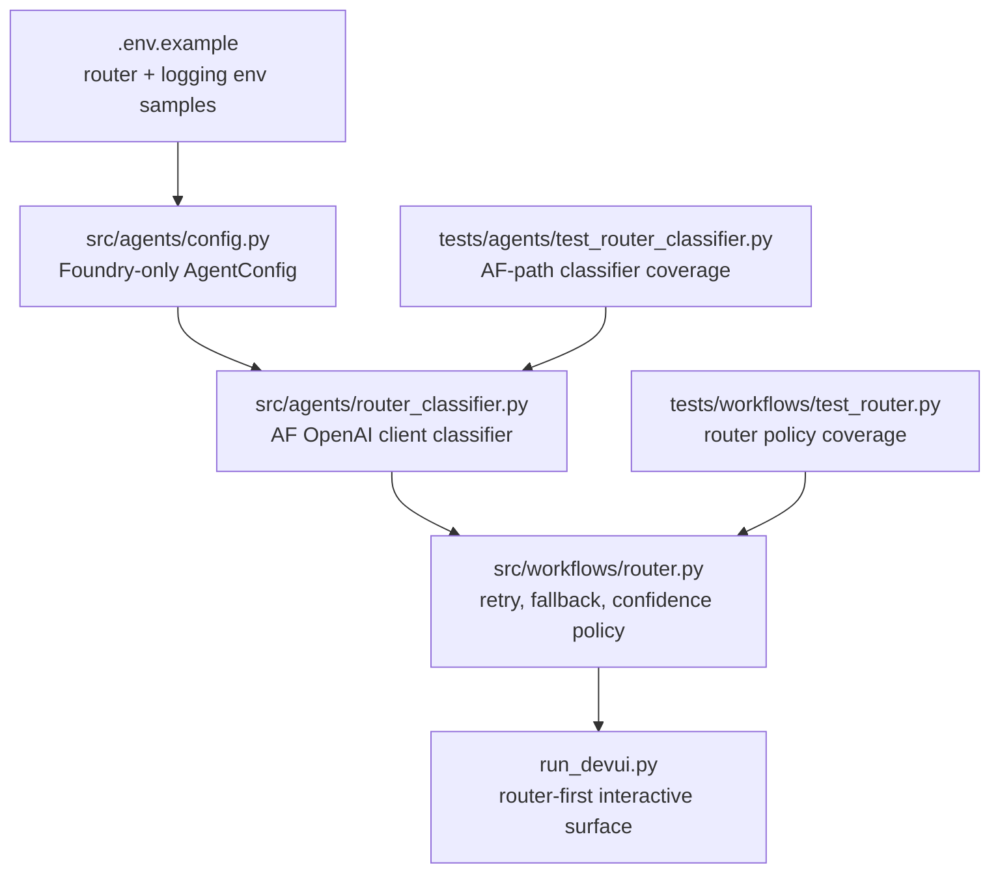

# Part 6 Implementation Notes — Production Router Integration

## Overview

Part 6 migrates the tutorial series to a production-ready routing posture by relying exclusively on Microsoft Azure AI Foundry model router deployments. The workflows module now depends on a dedicated router classifier path, updated configuration contracts, and refreshed operational logging.

**Key Decisions:**

- Retire multi-provider abstractions in favor of Foundry-only endpoints.
- Standardize classifier traffic on the Agent Framework OpenAI client path.
- Surface router metadata (mode, subset, model) for observability and debugging.
- Keep the router workflow as the only production surface while sequential/concurrent remain internal patterns.
- Add explicit `out_of_context` handling so unsupported queries do not consume retrieval workflow paths.
- Gate expensive evaluation runs by stage: PRs run local checks, `main` runs Foundry publishing + red-team.

---

## What Was Built

The documentation set was also updated: [README.md](../README.md) (root), [docs/README.md](README.md), and [docs/part3-implementation-notes.md](part3-implementation-notes.md) clarify that production traffic must go through the router workflow. Part 3 remains historical; this file captures the current production stance.

---

## Agent Configuration Refresh

[src/agents/config.py](../src/agents/config.py) now enforces a Foundry-only contract:

- **Required:** `AZURE_OPENAI_ENDPOINT`, `AZURE_OPENAI_CHAT_DEPLOYMENT`, and `AZURE_OPENAI_ROUTER_DEPLOYMENT`.
- **Authentication:** Defaults to API-key headers; falls back to Azure CLI (`DefaultAzureCredential`) when `AZURE_OPENAI_API_KEY` is absent.
- **Metadata:** Optional `AZURE_OPENAI_ROUTER_SUBSET` values are surfaced for logging/telemetry.
- **Endpoint override:** `AZURE_OPENAI_ROUTER_ENDPOINT` lets the router use a different base URL (for example the classic `https://<resource>.openai.azure.com`) while chat and embeddings continue to use the primary endpoint.
- **Base URL helper:** `azure_base_url` normalizes the `/openai/v1/` prefix shared by Foundry-hosted deployments.

`AgentConfig.validate_mcp_server()` continues to guard against malformed MCP URLs (tooling still depends on [run_mcp_server.py](../run_mcp_server.py)).

Environment template updates in [.env.example](../.env.example) reflect the dedicated router deployment and metadata placeholders.

---

## Router Classifier (Foundry Chat Completions)

[src/agents/router_classifier.py](../src/agents/router_classifier.py) now classifies through `OpenAIChatCompletionClient` (Agent Framework OpenAI client path). The classifier does not maintain a separate raw REST transport path.

The classifier issues a chat completions request and raises `RouterClassifierError` when classification fails. `RouterWorkflow` then applies reliability policy at orchestration level: retry transient failures, and if classification still fails, degrade to the sequential workflow with explicit fallback metadata.

Highlights:

- **Single runtime path:** Uses Agent Framework client requests and parses responses into a stable `RouterClassification` contract.
- **System prompt:** `_ROUTER_SYSTEM_PROMPT` produces compact JSON (`workflow`, `confidence`, `reason`).
- **Response parsing:** `_extract_chat_response_text()` normalizes payload variants; `_strip_fences()` removes Markdown fences before JSON parsing.
- **Metadata extraction:** `_extract_router_metadata()` inspects the response payload (or nested metadata objects) to capture the final routed model and subset for observability.
- **Failure handling:** Classification errors raise `RouterClassifierError`; the router workflow retries transient failures and then degrades to sequential with audited metadata (`classifier_status`, `classifier_attempts`, `fallback_reason`).

The classifier returns a `RouterClassification` dataclass consumed by [src/workflows/router.py](../src/workflows/router.py) to decide delegated workflow execution.

---

## Workflow Surface Alignment

`uv run python run_devui.py` is the interactive runtime surface. Router remains the production default workflow, while sequential and concurrent patterns are retained for debugging and targeted validation.

For Teams/Agents Playground compatibility, `run_router_chatbot.py` exposes a connector-oriented endpoint at `/api/messages` backed by `RouterWorkflow`.

---

## Router Output Contract (Current)

`RouterWorkflow` now preserves both classification intent and executed path in step metadata:

- `classified_workflow`: raw classifier label
- `routed_workflow`: final executed workflow after policy/fallback
- `classifier_status`: classifier outcome state
- `classifier_attempts`: retry count
- `fallback_reason`: deterministic explanation when fallback occurs

The `out_of_context` route is handled as a first-class label. When selected, the router returns a direct safe response path and avoids in-context retrieval fan-out.

---

## Evaluation and CI Governance

Router evaluation now follows a staged policy:

- **PR path:** local-only router batch checks for merge gating.
- **Main path:** full router batch plus Foundry publish and red-team checks when relevant files changed.

Workflow split:

- `.github/workflows/ci.yml`: core lint/type/test pipeline for push and PR validation.
- `.github/workflows/router-evaluation.yml`: reusable evaluator workflow (local, Foundry, optional red-team toggles).
- `.github/workflows/router-main-evaluation.yml`: `main`-only workflow that runs full router evaluation with Foundry publish + red-team when relevant files changed.
- `.github/workflows/router-pr-merge-gate.yml`: required PR gate workflow triggered on PR lifecycle updates (`opened`, `reopened`, `synchronize`, `labeled`) and review submissions; expensive router evaluation remains conditional.

Execution surface policy:

- Manual runs use `.github/workflows/router-evaluation.yml`.
- `.github/workflows/router-main-evaluation.yml` is push-only and intentionally has no manual dispatch inputs.
- Workflow configuration and cost profiles are documented in `.github/workflows/README.md`.

Gate behavior in PRs:

- The required gate workflow is present on new PR commits so merge checks are not left in a missing/stale state.
- Router evaluation execution is still controlled by internal diff detection (`run_eval=true/false`) and approval/ready-to-merge conditions.
- Doc-only or otherwise non-relevant updates can still complete the gate without running token-heavy evaluation steps.

This preserves deterministic merge enforcement while reducing unnecessary evaluation spend.

---

## Infrastructure Alignment

Terraform now provisions dedicated chat deployments for router-era workloads:

- `graphrag-main-chat` (application runtime)
- `graphrag-main-eval` (batch evaluator judge)
- `graphrag-main-redteam` (red-team target)

The stack also keeps optional legacy GPT-4o deployment support behind `enable_legacy_chat_deployment`, enabling safe migration without hard cutovers.

Router deployment naming is explicit through `AZURE_OPENAI_ROUTER_DEPLOYMENT` and currently references an existing manual `model-router` deployment (unmanaged by Terraform state).

---

## Testing Strategy

[tests/agents/test_router_classifier.py](../tests/agents/test_router_classifier.py) uses AF-oriented stubs to validate:

- Request payload structure (system prompt, JSON-only response format, temperature=0).
- Credential handling (API key vs Azure CLI token provider path).
- Workflow parsing, confidence normalization, and reason extraction.
- Metadata overrides when the Foundry response includes router annotations.
- Error handling when the router deployment rejects or fails the request.

[tests/workflows/test_router.py](../tests/workflows/test_router.py) validates router orchestration behavior:

- Unknown classifier labels degrade to sequential while preserving classified vs routed workflow metadata.
- Transient classifier failures retry and recover without manual intervention.
- Non-retryable classifier failures degrade to sequential with explicit fallback metadata.

These tests run under `uv run pytest tests/agents/test_router_classifier.py` and ensure the classifier tolerates Foundry's response variants.

---

## Deferred Follow-Ups

- Align environment samples with portal-generated deployment names once the Foundry router is provisioned.
- Execute `main` merge validation and confirm Foundry publish + Red Team run outcomes before final release/tag.
- Add end-to-end evaluation traces exercising the router workflow after deployment to Foundry.
- Expand telemetry dashboards to display `router_subset` facets when available.
