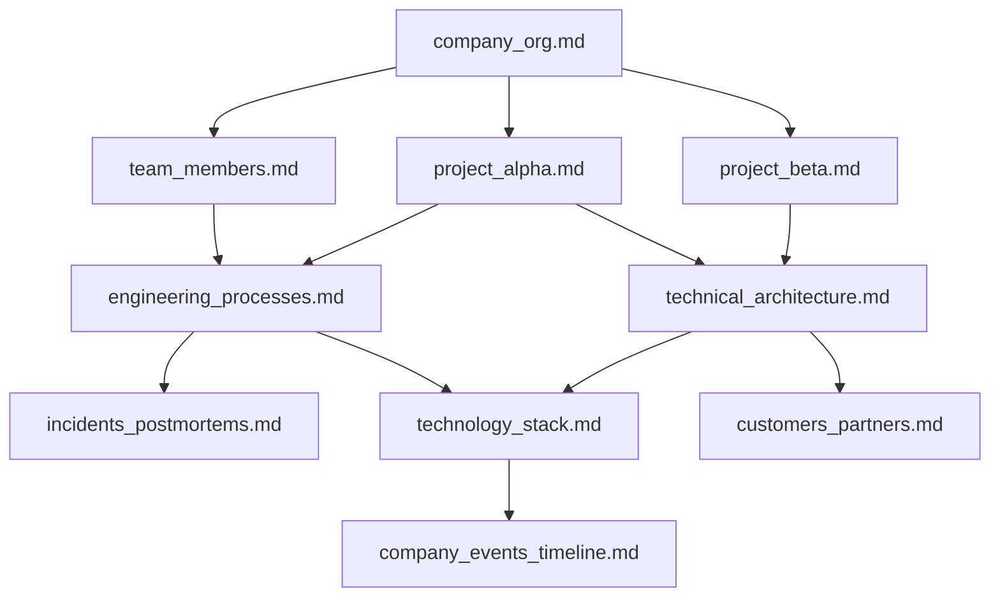

# Input Documents

This folder contains sample documents for the GraphRAG knowledge graph.

## Documents Overview

| Document                     | Description                   | Key Entities                          |
| ---------------------------- | ----------------------------- | ------------------------------------- |
| `company_org.md`             | Organizational structure      | Departments, roles, reporting lines   |
| `project_alpha.md`           | AI Assistant platform project | Phases, milestones, technical specs   |
| `team_members.md`            | Team member profiles          | People, skills, backgrounds           |
| `project_beta.md`            | Healthcare analytics project  | HIPAA, pilot customers, phases        |
| `technical_architecture.md`  | System architecture details   | Services, components, infrastructure  |
| `technology_stack.md`        | Technology standards          | Languages, frameworks, cloud services |
| `customers_partners.md`      | Customer case studies         | Enterprise customers, partnerships    |
| `engineering_processes.md`   | Development methodology       | Squads, guilds, code review, testing  |
| `incidents_postmortems.md`   | Incident history              | Outages, root causes, lessons learned |
| `company_events_timeline.md` | Company milestones            | Funding rounds, conferences, awards   |

## Document Interconnections

These 10 documents are intentionally interconnected to demonstrate GraphRAG's ability to detect entities and relationships across multiple sources:

### Key Entity Types

- **People:** 25+ team members with roles, skills, and relationships
- **Projects:** Project Alpha (AI), Project Beta (Healthcare)
- **Organizations:** TechVenture, GlobalBank, Meridian Healthcare, Apex Manufacturing
- **Technologies:** Azure, GraphRAG, FastMCP, Python, TypeScript
- **Events:** Incidents, conferences, milestones, funding rounds

### Cross-Document Relationships

### Example Queries Enabled

With 10 documents, you can ask complex cross-document questions:

1. **Cross-project:** "Which team members work on both Project Alpha and Project Beta?"
2. **Incident analysis:** "What incidents were caused by GraphRAG and who resolved them?"
3. **Customer relationships:** "Which Azure services are used for GlobalBank deployment?"
4. **Timeline correlation:** "What events happened around the time of INC-2024-001?"
5. **Technology coverage:** "Who are the experts in Python and what projects do they lead?"

## Statistics

After indexing, expect approximately:

- **100+ entities** across all entity types
- **300+ relationships** connecting entities
- **15+ communities** representing topic clusters
- Rich context for both local and global search queries
