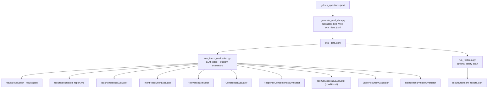

# Part 5: Agent Evaluation — Monitoring, Evaluation & Safety

End-to-end evaluation pipeline for the router-first GraphRAG assistant using the Azure AI Evaluation SDK,
OpenTelemetry tracing, and optional red team safety scanning.

### Quality Pillars

- **Monitoring**: OpenTelemetry instrumentation (local OTLP or Application Insights) keeps live agent runs observable.
- **Quality evaluation**: Azure AI Evaluation SDK judges plus custom GraphRAG entity and relationship validators measure grounded accuracy.
- **Safety evaluation**: Red-team flows probe deployments with Azure AI Foundry attack strategies to surface risky behaviors.

## Architecture



## Prerequisites

- Knowledge graph already indexed (`uv run python -m maf_graphrag.core.index`)
- MCP server running on `localhost:8011`
- Azure OpenAI credentials in `.env`

## Environment Variables

### Required (all scripts)

| Variable                       | Description                              |
| ------------------------------ | ---------------------------------------- |
| `AZURE_OPENAI_ENDPOINT`        | Azure OpenAI service endpoint            |
| `AZURE_OPENAI_API_KEY`         | Azure OpenAI API key                     |
| `AZURE_OPENAI_CHAT_DEPLOYMENT` | Chat deployment name (default: `gpt-4o`) |

### Optional (evaluation model override)

| Variable                            | Description                                                                                         |
| ----------------------------------- | --------------------------------------------------------------------------------------------------- |
| `AZURE_OPENAI_EVAL_CHAT_DEPLOYMENT` | Deployment used only by Step 3 evaluators. Defaults to `AZURE_OPENAI_CHAT_DEPLOYMENT` when omitted. |

### Optional (Foundry dashboard + red teaming)

| Variable           | Description                                                                            |
| ------------------ | -------------------------------------------------------------------------------------- |
| `AZURE_AI_PROJECT` | Foundry project URL (`https://<account>.services.ai.azure.com/api/projects/<project>`) |

Step 4 requires `AZURE_AI_PROJECT` and uses the Foundry project endpoint path.

### Required in GitHub Actions for Foundry publish and red-team

When Step 3 (`--foundry`) and Step 4 run in CI, `DefaultAzureCredential` must resolve
to a service principal. Configure these repository secrets:

| Secret                | Description                                         |
| --------------------- | --------------------------------------------------- |
| `AZURE_TENANT_ID`     | Microsoft Entra tenant ID for the service principal |
| `AZURE_CLIENT_ID`     | Service principal application (client) ID           |
| `AZURE_CLIENT_SECRET` | Service principal client secret                     |

Also keep `AZURE_AI_PROJECT` configured, and ensure this service principal has permission
to create/read evaluation runs in the target Foundry project.

### Optional (Application Insights monitoring)

| Variable                                | Description                                                                |
| --------------------------------------- | -------------------------------------------------------------------------- |
| `APPLICATIONINSIGHTS_CONNECTION_STRING` | App Insights connection string for production traces                       |
| `OTEL_TRACING_ENDPOINT`                 | OTLP endpoint for local tracing backend (default: `http://localhost:4317`) |
| `ENABLE_SENSITIVE_DATA`                 | Include raw prompts and responses in telemetry spans (set to `true`/`1`)   |

### Optional (custom evaluators)

| Variable                     | Description                   | Default                                     |
| ---------------------------- | ----------------------------- | ------------------------------------------- |
| `ENTITIES_PARQUET_PATH`      | Path to entities Parquet      | `output/create_final_entities.parquet`      |
| `RELATIONSHIPS_PARQUET_PATH` | Path to relationships Parquet | `output/create_final_relationships.parquet` |

## Evaluation Workflow

### Region Strategy (Single Project)

Use one Foundry project in a region that supports the features you need most.

- Step 3 (batch evaluation) and Step 4 (red teaming) can use the same project.
- For best coverage, prefer a region documented for evaluation + red teaming support (for example `East US 2` or `France Central`).
- If your selected region lacks required safety capabilities, move the project to a supported region.

### Step 1 — Start the MCP server (terminal 1)

```powershell
uv run python run_mcp_server.py
```

### Step 2 — Generate evaluation data (terminal 2)

Runs the router workflow against each of the 10 golden questions and writes
`src/maf_graphrag/evaluation/datasets/eval_data.jsonl`:

Step 2 is independent from Foundry publishing. If you already have `eval_data.jsonl`, you can reuse it directly.

```powershell
uv run python -m maf_graphrag.evaluation.scripts.generate_eval_data
```

Router-focused variant (includes `out_of_context` routing checks and writes `eval_router_data.jsonl`):

```powershell
uv run python -m maf_graphrag.evaluation.scripts.generate_router_eval_data
```

Router dataset rule for edge cases:

- `expected_routed_workflow` remains the coarse label used in reports (`in_context` / `out_of_context`).
- `accepted_routed_workflows` can list multiple valid concrete routes for a prompt (for example `handoff` and `sequential`).
- `route_match` is computed against that accepted set, so ambiguity does not create false negatives.

Output:

```
Processed 10/10 test cases
Evaluation data written to src/maf_graphrag/evaluation/datasets/eval_data.jsonl
```

### Step 3 — Run batch evaluation

Uses Azure OpenAI as the LLM-judge for five built-in quality evaluators, plus
the two custom graph evaluators that validate against the Parquet files.
`ToolCallAccuracyEvaluator` is included conditionally when structured `tool_call`
entries are present in `eval_data.jsonl`:

> Note: if your chat deployment rejects `max_tokens` (requires `max_completion_tokens`),
> the script automatically skips `IntentResolutionEvaluator` and continues with the
> remaining evaluators.

To avoid the skip, set `AZURE_OPENAI_EVAL_CHAT_DEPLOYMENT` to a compatible deployment used only for evaluators.

```powershell
# Standard evaluation (results saved locally)
uv run python -m maf_graphrag.evaluation.scripts.run_batch_evaluation

# Router-focused dataset evaluation
uv run python -m maf_graphrag.evaluation.scripts.run_batch_evaluation --data eval_router_data.jsonl

# Skip custom graph evaluators (no Parquet needed)
uv run python -m maf_graphrag.evaluation.scripts.run_batch_evaluation --no-custom

# Publish a Foundry evaluation run (openai/v1/evals)
uv run python -m maf_graphrag.evaluation.scripts.run_batch_evaluation --foundry
```

Results are written to:

- `src/maf_graphrag/evaluation/results/evaluation_results.json` — raw SDK output
- `src/maf_graphrag/evaluation/results/evaluation_report.md` — human-readable Markdown summary

When `--foundry` is enabled, Step 3 publishes through the Foundry `openai/v1/evals`
endpoint and writes the returned `report_url` into the local report (`studio_url` field).

Evaluation outputs vary by dataset and deployment, but local artifacts always preserve per-run metrics, token usage, and any Foundry-linked report URLs.

- `ToolCallAccuracyEvaluator` is emitted only when `eval_data.jsonl` contains structured `tool_call` items.
- Custom graph evaluators remain available in local artifacts (`evaluation_results.json`, `evaluation_report.md`).

### Step 4 — (Optional) Red team safety scan

Requires an Azure AI Foundry project. **You do not need to redeploy your OpenAI models** — the Foundry
project is only used to submit the red team job and store results. LLM calls still go to your existing
`AZURE_OPENAI_ENDPOINT`.

Step 4 supports two flows:

- `cloud-model` (default, recommended): scans your Azure OpenAI deployment directly.
- `local-agent`: scans the local router workflow callback target.

Use `cloud-model` for the most stable Foundry-compatible path.

**Provision via Terraform** (adds a Foundry project under AI Services):

```hcl
# infra/terraform.tfvars
enable_foundry = true
```

```powershell
cd infra
terraform apply
terraform output -raw env_file_content > ../.env  # adds AZURE_AI_PROJECT automatically
```

```powershell
# Default flow: cloud-model, Baseline + EASY strategies, all 4 risk categories
uv run python -m maf_graphrag.evaluation.scripts.run_redteam

# Explicit cloud flow
uv run python -m maf_graphrag.evaluation.scripts.run_redteam --flow cloud-model

# Local callback flow (requires MCP server running)
uv run python -m maf_graphrag.evaluation.scripts.run_redteam --flow local-agent

# Custom strategies
uv run python -m maf_graphrag.evaluation.scripts.run_redteam --flow cloud-model --strategies baseline jailbreak crescendo

# Custom risk categories
uv run python -m maf_graphrag.evaluation.scripts.run_redteam --flow cloud-model --risks Violence HateUnfairness
```

Optional environment override:

```powershell
$env:REDTEAM_FLOW = "cloud-model"  # or local-agent
```

Available attack strategies: `baseline`, `jailbreak`, `crescendo`, `easy`, `moderate`, `difficult`, `multiturn`

Available risk categories: `Violence`, `HateUnfairness`, `Sexual`, `SelfHarm`

Results are written to `src/maf_graphrag/evaluation/results/redteam_results.json`.

In `cloud-model` flow, Step 4 also attempts a Foundry `openai/v1/evals` red-team
reference run and stores its metadata under `new_foundry` in the JSON output. This keeps
the full SDK red-team scorecard while providing a Foundry report URL.

Important behavior: if the scan completes but yields zero evaluated attacks (`0/0`), the script exits with
an explicit error. In practice, this usually indicates your selected region does not support required RAI
safety scoring capabilities (for example content-harm scoring). Keep a single project architecture, but place
that project in a region that supports Step 4 red teaming.

## Suggested Screenshots for Documentation

Use these Foundry views when documenting Part 5 outcomes:

| Screenshot                                                                             | Include in        | Why it is useful                                                                                                                               |
| -------------------------------------------------------------------------------------- | ----------------- | ---------------------------------------------------------------------------------------------------------------------------------------------- |
| Batch run details (`graphrag-batch-...-run`) with overall metrics and detailed rows    | Evaluation README | Shows quality results (`task_adherence`, `intent_resolution`, `relevance`, `coherence`, `response_completeness`) and token usage in one place. |
| Red team run details (`graphrag-redteam-...-run`) with ASR metrics and attack outcomes | Evaluation README | Shows safety metrics by risk category and attack strategy.                                                                                     |
| Evaluations list page and Red team list page                                           | Root README       | Gives a quick project-level proof that both quality and safety workflows run successfully.                                                     |

Avoid using reduced-detail run pages that only show token counts, they do not communicate evaluation quality.

## Monitoring with OpenTelemetry

MAF agents automatically emit `gen_ai.*` spans for LLM calls, tool invocations, and agent steps.
Use `setup_monitoring()` from `evaluation.monitoring.otel_setup` before running agents.

### Local development

Set `OTEL_TRACING_ENDPOINT` to any local OTLP-compatible backend. Then in your code:

```python
from evaluation.monitoring.otel_setup import setup_monitoring
setup_monitoring()  # sends OTLP to OTEL_TRACING_ENDPOINT
```

### Production — Application Insights

Set `APPLICATIONINSIGHTS_CONNECTION_STRING` in your environment and call:

```python
from evaluation.monitoring.otel_setup import setup_monitoring
from evaluation.config import EvalConfig

config = EvalConfig.from_env()
setup_monitoring(config)
```

Set `ENABLE_SENSITIVE_DATA=true` (or `1`) before calling `setup_monitoring` if you need spans to include raw prompts and responses. Enable this switch only in secure environments because it copies user input and agent output into telemetry payloads.

Application Insights is provisioned automatically when you run `terraform apply` from `infra/`.
The connection string is exported as `application_insights_connection_string` and included in
the `.env` file generated by `terraform output -raw env_file_content > ../.env`.

## Evaluators Reference

### Built-in (LLM-as-judge, require Azure OpenAI)

| Evaluator                       | What it measures                               | Output    |
| ------------------------------- | ---------------------------------------------- | --------- |
| `TaskAdherenceEvaluator`        | Does the response complete the requested task? | 0–5 scale |
| `IntentResolutionEvaluator`     | Does the response address the user's intent?   | 0–5 scale |
| `RelevanceEvaluator`            | Is the response relevant to the query?         | 0–5 scale |
| `CoherenceEvaluator`            | Is the response logically consistent?          | 0–5 scale |
| `ResponseCompletenessEvaluator` | Does the response cover expected content?      | 0–5 scale |

### Built-in tool behavior (conditional)

| Evaluator                   | What it measures                                     | Output    |
| --------------------------- | ---------------------------------------------------- | --------- |
| `ToolCallAccuracyEvaluator` | Were the right tools called with correct parameters? | 0–1 scale |

### Custom (graph-based, no LLM)

| Evaluator                       | What it measures                                                                   | Output    |
| ------------------------------- | ---------------------------------------------------------------------------------- | --------- |
| `EntityAccuracyEvaluator`       | How many named entities in the response exist in the knowledge graph?              | 0–1 score |
| `RelationshipValidityEvaluator` | How many entity co-occurrences in the response reflect actual graph relationships? | 0–1 score |

## Module Structure

```
src/maf_graphrag/evaluation/
├── config.py                   # EvalConfig dataclass (from_env())
├── datasets/
│   ├── golden_questions.jsonl  # 10 hand-crafted test cases for TechVenture KB
│   └── eval_data.jsonl         # Generated by generate_eval_data.py (gitignored)
├── evaluators/
│   ├── builtin.py              # Wrappers + message conversion for SDK evaluators
│   ├── entity_accuracy.py      # Custom: entity existence in graph Parquet
│   └── relationship_validity.py# Custom: relationship existence in graph Parquet
├── monitoring/
│   └── otel_setup.py           # OpenTelemetry setup (OTLP + App Insights)
├── results/                    # Created at runtime (gitignored)
└── scripts/
    ├── generate_eval_data.py   # Step 2: run agent → eval_data.jsonl
    ├── run_batch_evaluation.py # Step 3: batch evaluate with SDK
    └── run_redteam.py          # Step 4: safety scan (Foundry required)
```
