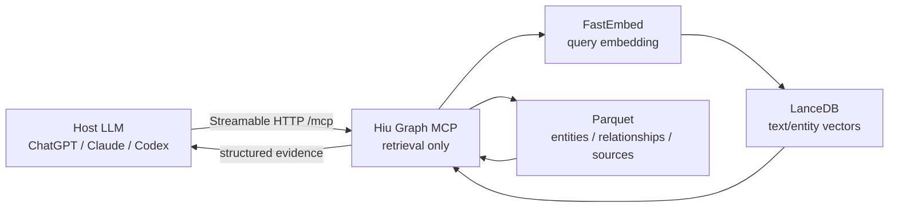

# GraphRAG Retrieval MCP Server

Exposes an indexed GraphRAG knowledge graph as retrieval-only MCP (Model Context Protocol) tools. Indexing can use Gemma/llama.cpp for graph extraction and summarization, but MCP query-time tools do not call a completion LLM.

## Architecture



The lifecycle is intentionally split:

```text
Indexing / re-indexing:
  Documents -> Gemma/llama.cpp -> graph artifacts
            -> FastEmbed       -> vector artifacts

MCP runtime with an existing index:
  Query -> FastEmbed -> LanceDB/Parquet -> structured evidence
  No LiteLLM or llama.cpp completion call.
```

## Quick start

```bash
uv run python run_mcp_server.py
```

Server endpoint: `http://localhost:8011/mcp`

If the index already exists, `LLAMA_CPP_BASE_URL` and the GGUF model do not need to be available for MCP queries. The Docker entrypoint only waits for llama.cpp when it detects a missing/incomplete index and must index first.

## MCP tools

The server advertises exactly five tools.

### `semantic_search(query, limit=10)`

Embeds the query with the same FastEmbed model used at index time and searches the `text_unit_text` LanceDB table. Returns ranked source text; it does not generate an answer.

Example request:

```json
{
  "query": "Who leads Project Alpha?",
  "limit": 5
}
```

Representative response shape:

```json
{
  "matches": [
    {
      "text_unit_id": "...",
      "text": "...",
      "score": 0.91,
      "document_ids": ["..."]
    }
  ],
  "returned": 1,
  "query_type": "semantic_text"
}
```

### `search_entities(query, limit=10)`

Searches the `entity_description` LanceDB table and hydrates entity metadata from `entities.parquet`.

```json
{
  "query": "Project Alpha",
  "limit": 5
}
```

Returns entity ID, name, type, description, community IDs, and relevance score.

### `get_entity(entity_name)`

Performs direct case-insensitive entity lookup from the generated graph data. No vector search or completion LLM is involved.

```json
{
  "entity_name": "Project Alpha"
}
```

### `get_relationships(entity_name, limit=20)`

Traverses direct incoming/outgoing relationship rows for an indexed entity.

```json
{
  "entity_name": "Project Alpha",
  "limit": 20
}
```

Returns source, target, counterpart, direction, and available relationship description/weight/rank fields.

### `get_sources(source_ids, limit=20)`

Resolves text-unit IDs returned by `semantic_search` to source/document metadata.

```json
{
  "source_ids": ["<text-unit-id>"],
  "limit": 20
}
```

Returns document IDs/titles and text previews when available, plus unresolved IDs.

## Recommended host flow

```text
1. semantic_search("Who leads Project Alpha?")
2. search_entities("Project Alpha") or get_entity("Project Alpha")
3. get_relationships("Project Alpha")
4. get_sources(["<text-unit-id>"])
5. Host LLM synthesizes and cites the answer from those results.
```

This avoids an unnecessary Host LLM -> MCP -> local Gemma -> Host LLM chain.

## Breaking migration

The following generative MCP tools were intentionally removed from the public MCP surface:

- `search_knowledge_graph`
- `local_search`
- `global_search`
- `list_entities`

The underlying generative GraphRAG helpers remain in `maf_graphrag.core.search` for chat and explicit non-MCP workflows. MCP callers should migrate to the five retrieval primitives above.

## FastEmbed configuration

Index-time and query-time embeddings must use the same model:

| Variable | Default | Purpose |
| --- | --- | --- |
| `FASTEMBED_MODEL_NAME` | `BAAI/bge-small-en-v1.5` | Shared embedding model |
| `FASTEMBED_CACHE_DIR` | `.cache/fastembed` | Local model cache; Docker defaults to `/data/fastembed` |

MCP server configuration remains:

| Variable | Default |
| --- | --- |
| `MCP_HOST` | `127.0.0.1` |
| `MCP_PORT` | `8011` |
| `GRAPHRAG_ROOT` | `.` |
| `MCP_CORS_ORIGINS` | `http://127.0.0.1:8011` |

## Testing with MCP Inspector

```bash
# Terminal 1
uv run python run_mcp_server.py

# Terminal 2
npx @modelcontextprotocol/inspector
```

Use **Transport = Streamable HTTP** and **URL = `http://localhost:8011/mcp`**. The Tools tab should list exactly the five retrieval tools documented above.

## Module structure

```text
mcp_server/
├── config.py
├── server.py
├── retrieval/
│   ├── query_encoder.py   # cached FastEmbed query encoder
│   └── vector_store.py    # LanceDB read adapter
└── tools/
    ├── _data_cache.py
    ├── entity_query.py
    ├── relationships.py
    ├── retrieval_search.py
    ├── source_resolver.py
    ├── sources.py
    └── types.py
```

## Verification contract

A release must demonstrate:

1. a valid index exists;
2. llama.cpp is stopped or unreachable;
3. MCP starts successfully;
4. all five advertised tools return retrieval results;
5. MCP query logs contain no `LiteLLM completion()` lines.

Run unit tests with:

```bash
uv run pytest tests/mcp_server -q
```

## References

- [Model Context Protocol](https://modelcontextprotocol.io/)
- [FastMCP Documentation](https://gofastmcp.com/)
- [MCP Inspector](https://modelcontextprotocol.io/docs/tools/inspector)
- [Microsoft GraphRAG](https://github.com/microsoft/graphrag)
