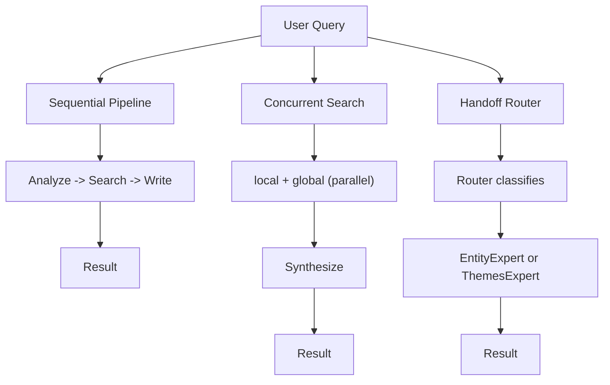
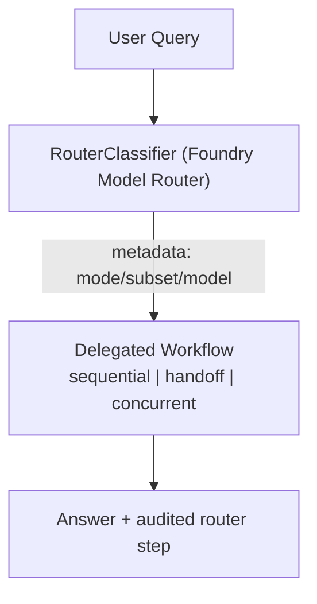
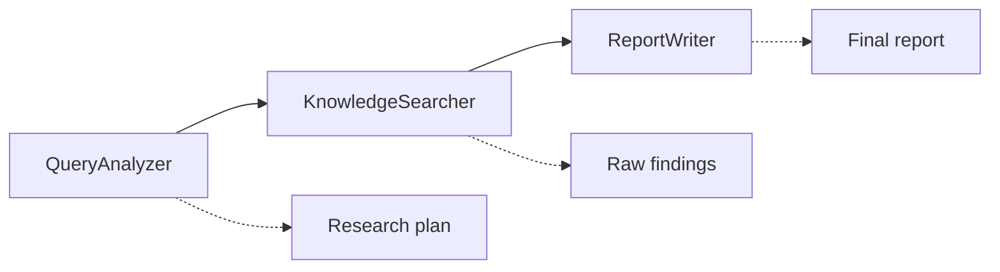
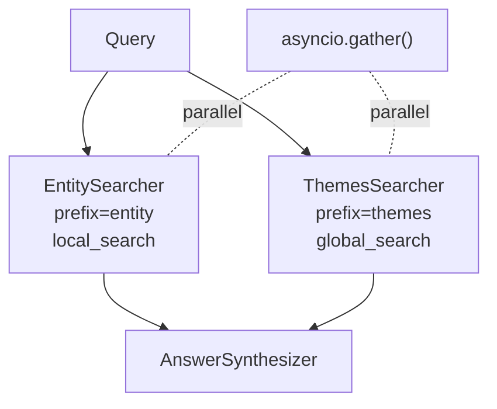
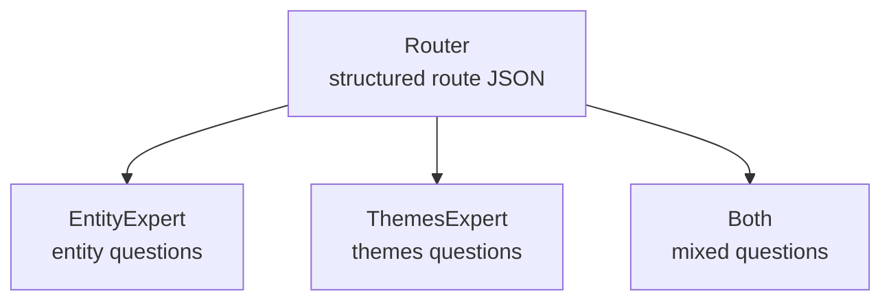

# Workflows Module — Part 4: Workflow Patterns

Multi-agent workflow patterns that power the router-first GraphRAG assistant. The **Router workflow** is the production entry point that downstream chat surfaces should invoke; the other patterns remain available for experimentation, regression tests, and targeted demos.

Factory helpers such as `create_router_workflow`, `create_sequential_workflow`, and their peers always build a new `WorkflowBuilder` graph. This keeps router agents, MCP tools, and Azure clients isolated per request so long-lived services (DevUI, chat endpoints) can reuse the factories without leaking state.

## Architecture



## Granularity Guideline

The workflows in this repo should stay small enough to read at a glance, but
split responsibilities when the split helps debugging or makes the control
flow materially clearer.

Use this rule of thumb:

| Split a step when...                                         | Keep it combined when...                                     |
| ------------------------------------------------------------ | ------------------------------------------------------------ |
| The step changes state or responsibility meaningfully        | The split only makes DevUI look more detailed                |
| A failure would need separate handling or retry logic        | The step would only wrap another step without adding value   |
| The input/output contract is easier to understand separately | The split would add more than one extra node without clarity |

For this repo, a good target is usually 3-5 visible steps per workflow.
The samples in `samples/workflow_with_agents/` follow the same pattern: a
single graph, with each executor representing a real processing boundary,
not a nested workflow.

## Workflow Patterns

### Production Default: Router Workflow (`router.py`)

The router pairs a Foundry classifier with specialist workflows and records the chosen path, including router metadata captured from `AgentConfig`. In production deployments the router is the only workflow exposed to user-facing chatbots or APIs.

Reliability behavior in the current implementation:

- Transient classifier failures (timeout/429/5xx) retry automatically before routing.
- Classifier failures degrade to `sequential` with explicit metadata (`classifier_status=fallback`, `fallback_reason=classifier_error`).
- Classifier confidence is quantitative (`confidence_score` 0-100). Scores below 80 degrade to `sequential` for safer coverage, while preserving `classified_workflow` for audit.
- Unknown classifier labels also degrade to `sequential` and keep both `classified_workflow` and `routed_workflow` for auditability.
- Incoming payloads are normalized to plain query text before classification to avoid dict-shaped prompt artifacts.

Event and observability standardization:

- Streamed workflow signals use `WorkflowEvent` objects consistently.
- Router streaming emits a custom `progress` event (`type="progress"`) with structured delegation metadata before the delegated workflow begins.
- Stream failures are emitted as `WorkflowEvent(type="error", data=...)` rather than ad-hoc dict payloads.
- Reserved workflow lifecycle event types (`started`, `status`, `failed`) are not emitted by custom code.



#### Session-aware routing and checkpoint readiness

- Session identity is deterministic per channel + conversation + user. `RouterWorkflow` consumes the bounded history supplied by `RouterChatService` to keep follow-up turns contextual.
- Structured session diagnostics (`session_id`, `turn_index`, `memory_hits`, lock timings, cleanup counters) flow through router span attributes, logs, and connector payloads. This gives Auditors the same trace whether they review logs or channel data.
- Checkpoint storage is threaded through the router and its delegated workflows. On timeout, the latest superstep checkpoint is persisted and automatically offered for the next turn; stale or incompatible checkpoints are rejected safely before execution.
- Manual induced-timeout validation is deferred for now due to operational overhead. Automated tests cover checkpoint acceptance/rejection paths, so no workflow changes are required when that surface is exercised later.
- Because MCP sessions now reuse the same Streamable HTTP channel across turns, the first follow-up message may spend extra time resuming the existing session (expect ~2–3s of additional latency). Subsequent turns stay within the original SLA.

### DevUI Graph Metadata (tutorial-only tradeoff)

For the DevUI demo we instantiate each WorkflowBuilder graph when metadata is requested so we can reuse the Agent Framework `workflow.to_dict()` output (it includes internal executor aliases used by the sample UI). This spins up the agents, Azure client, and MCP tool even though we only need the blueprint. Production services should replace this with a cached or hand-authored blueprint to avoid touching downstream services during metadata discovery.

| Step | Component          | Purpose                                                            |
| ---- | ------------------ | ------------------------------------------------------------------ |
| 1    | RouterClassifier   | Calls Foundry router deployment, requests structured JSON decision |
| 2    | RouterWorkflow     | Applies confidence-aware policy, logs decision + fallback metadata |
| 3    | Delegated workflow | Executes the selected workflow instance                            |

**Best for**: Any production chatbot or API. Provides auditable routing, steady interface, and optional traffic partitioning via router metadata.

### Supplemental 1. Sequential Workflow (`sequential.py`) — Research Pipeline


**When to use**: Complex, multi-part questions that need structured decomposition before searching.



| Step | Agent             | Role                                |
| ---- | ----------------- | ----------------------------------- |
| 1    | QueryAnalyzer     | Decomposes query into a search plan |
| 2    | KnowledgeSearcher | Executes MCP searches from the plan |
| 3    | ReportWriter      | Synthesizes into structured report  |

**Best for**:

- "What are the leadership, technology decisions, and strategic goals of Project Alpha?"
- Complex research questions that span multiple domains

### Supplemental 2. Concurrent Workflow (`concurrent.py`) — Parallel Search


**When to use**: Questions that benefit from both entity details AND organizational themes simultaneously.

Each parallel agent owns its own `MCPStreamableHTTPTool` with a `tool_name_prefix` (`entity`, `themes`) to avoid duplicate tool-name errors when both connect to the same MCP server.



| Step         | Agent             | Output                              |
| ------------ | ----------------- | ----------------------------------- |
| 1 (parallel) | EntitySearcher    | Entity details via local_search     |
| 2 (parallel) | ThemesSearcher    | Thematic patterns via global_search |
| 3            | AnswerSynthesizer | Merged comprehensive answer         |

**Best for**:

- "What are the main projects and who leads them?"
- Questions where entity-level and organizational-level perspectives complement each other

### Supplemental 3. Handoff Workflow (`handoff.py`) — Expert Routing


**When to use**: When you want explicit, auditable routing to specialist agents.



Router output contract:

```json
{
  "route": "entity | themes | both",
  "confidence_score": "0..100",
  "reason": "short explanation"
}
```

The handoff parser remains backward-compatible with legacy single-word outputs (`entity`, `themes`, `both`).

| Route  | Agent        | Search type   | Example query                        |
| ------ | ------------ | ------------- | ------------------------------------ |
| entity | EntityExpert | local_search  | "Who leads Project Alpha?"           |
| themes | ThemesExpert | global_search | "What are the main initiatives?"     |
| both   | Both in turn | both          | "Describe the projects and strategy" |

**Best for**:

- Demonstrating how routing becomes an explicit, logged step
- Systems with many specialist agents
- When routing logic must be auditable

**Balance note**: Keep `Router`, `EntityExpert`, `ThemesExpert`, and
`AnswerComposer` separate because each has a different responsibility and
failure domain. Do not split the experts further unless a new boundary
adds real value beyond DevUI visibility.

## Choosing the Right Workflow

| Workflow            | Speed       | Traceability | Best Use Case             | Why                                                |
| ------------------- | ----------- | ------------ | ------------------------- | -------------------------------------------------- |
| Router (production) | Medium      | Highest      | External chatbot/API      | Auditable routing + metadata, one stable surface   |
| Sequential          | Medium      | Highest      | Internal complex research | Prefers local_search; only uses global when needed |
| Handoff             | Medium–Slow | High         | Specialist demos          | Router skips global_search for entity-only queries |
| Concurrent          | Slowest     | Medium       | Internal dual perspective | **Always** runs global_search (slow map-reduce)    |

> **Performance note**: `global_search` uses map-reduce over all community reports (~32 LLM calls).
> Any workflow that triggers `global_search` will take 60–140s depending on Azure OpenAI rate limits.
> `local_search` uses vector similarity + graph traversal with a single LLM call (~5–15s).
> Choose **sequential** or **handoff(entity)** for fastest results on entity-specific questions.

## Quick Start

```bash
# Prerequisites
uv run python run_mcp_server.py   # Terminal 1

# Run DevUI as the supported interactive surface
uv run python run_devui.py
```

## Microsoft 365 Agents Playground

If you want a chatbot endpoint for Microsoft 365 Agents Playground, run the
router-backed endpoint and point Playground to `/api/messages`.

```bash
# Terminal 1: GraphRAG MCP server
uv run python run_mcp_server.py

# Terminal 2: Router chatbot endpoint (single entrypoint)
uv run python run_router_chatbot.py

# Terminal 3: Agents Playground
agentsplayground -e http://localhost:3978/api/messages -c msteams
```

Notes based on Microsoft Learn guidance:

- Keep this endpoint local-only; it accepts unauthenticated local requests for playground testing.
- Expose only the Router workflow for chat surfaces; sequential/concurrent/handoff remain internal specializations.
- Use `skipAuth` only for local development if you migrate to Microsoft 365 Agents SDK app scaffolds.

Reference docs:

- [Agents Playground overview](https://learn.microsoft.com/en-us/microsoftteams/platform/teams-sdk/developer-tools/agents-playground/overview?tabs=typescript%2Ccsharp%2Cpython)
- [Test your agent locally in Microsoft 365 Agents Playground](https://learn.microsoft.com/en-us/microsoft-365/agents-sdk/test-with-toolkit-project)

## Prompt Bank

### Router prompts

- "Who leads Project Alpha and how does it support TechVenture's strategy?"
- "Summarize the major initiatives and name the teams delivering them."
- "Give me both entity details and overarching themes for Project Beta."

### Sequential prompts

- "What are the leadership structure, technology choices, and strategic goals of Project Alpha?"
- "Give me a comprehensive overview of TechVenture Inc's engineering practices and team structure."
- "How does Project Beta connect to the broader organizational strategy?"

### Concurrent prompts

- "What are the main projects and who leads them?"
- "Who are the technical leads and what technologies does TechVenture focus on?"
- "Describe the team structure and the strategic initiatives at TechVenture Inc."

### Handoff prompts

- "Who leads Project Alpha?"
- "What are the main strategic initiatives at TechVenture Inc?"
- "Tell me about the technology stack used across all projects."

## Programmatic Usage

```python
from maf_graphrag.workflows import ResearchPipelineWorkflow, ParallelSearchWorkflow, ExpertHandoffWorkflow, RouterWorkflow

# Sequential
async with ResearchPipelineWorkflow() as wf:
    result = await wf.run("What is the technology strategy for Project Alpha?")
    print(result.answer)
    print(result.step_summary())   # Step-by-step trace

# Concurrent
async with ParallelSearchWorkflow() as wf:
    result = await wf.run("Who leads the projects and what are the key themes?")
    print(result.answer)

# Handoff
async with ExpertHandoffWorkflow() as wf:
    result = await wf.run("Who leads Project Alpha?")
    print(result.answer)

# Router (production default)
async with RouterWorkflow() as wf:
    result = await wf.run("Who leads Project Alpha and what are the key themes?")
    print(result.answer)
```

### Factory Functions (State Isolation)

Each call returns a fresh instance — agents and MCP connections are created on `__aenter__`, ensuring no state leaks between requests:

```python
from maf_graphrag.workflows import (
    create_sequential_workflow,
    create_concurrent_workflow,
    create_handoff_workflow,
    create_router_workflow,
)

# Each call returns a new, isolated workflow instance
workflow = create_sequential_workflow(mcp_url="http://localhost:8011/mcp")
async with workflow:
    result = await workflow.run("Analyze Project Alpha")

# Fresh instance — no shared state from the previous run
workflow2 = create_sequential_workflow()
async with workflow2:
    result2 = await workflow2.run("Analyze Project Beta")

# Production router entry point
router = create_router_workflow()
async with router:
    routed = await router.run("What changed in our delivery process?")
```

| Factory Function               | Returns                    |
| ------------------------------ | -------------------------- |
| `create_sequential_workflow()` | `ResearchPipelineWorkflow` |
| `create_concurrent_workflow()` | `ParallelSearchWorkflow`   |
| `create_handoff_workflow()`    | `ExpertHandoffWorkflow`    |
| `create_router_workflow()`     | `RouterWorkflow`           |

## WorkflowResult

Every workflow returns a `WorkflowResult`:

```python
@dataclass
class WorkflowResult:
    answer: str                     # Final synthesized answer
    workflow_type: WorkflowType     # sequential | concurrent | handoff | router
    steps: list[WorkflowStep]       # All intermediate agent outputs
    total_elapsed_seconds: float    # Wall-clock time for entire workflow
    query: str                      # Original user query
```

## Logging and Observability

- Per-step workflow logs are emitted under workflow-specific logger names (`workflows.router`, `workflows.handoff`, `workflows.sequential`, `workflows.concurrent`) to keep attribution clear.
- Set `WORKFLOW_STEP_LOGS=true` to enable step-level logs in DevUI runs.
- Entry points write structured logs under the `logs/` folder with daily filenames.

Each `WorkflowStep` contains:

```python
@dataclass
class WorkflowStep:
    agent_name: str          # e.g. "QueryAnalyzer"
    input_summary: str       # Short description of the input
    output: str              # Agent's full output text
    elapsed_seconds: float   # Time for this step
    metadata: dict           # Optional extra info
```

## Live Output Examples

### Handoff workflow sample output

```
Step 1: Router — classifying query...
Step 1: Router decided 'entity' (1.4s)
Step 2: EntityExpert — local search...
Step 2: EntityExpert completed (7.4s)

┏━━━━━━┳━━━━━━━━━━━━━━┳━━━━━━━━━━━━━━━━━━━━━━━━━━━━━━━━━━━━━━━━━━┳━━━━━━┓
┃ Step ┃ Agent        ┃ Action                                   ┃ Time ┃
┡━━━━━━╇━━━━━━━━━━━━━━╇━━━━━━━━━━━━━━━━━━━━━━━━━━━━━━━━━━━━━━━━━━╇━━━━━━┩
│ 1    │ Router       │ Classify: "Who leads Project Alpha?"     │ 1.4s │
│ 2    │ EntityExpert │ Entity-focused search for specific facts │ 7.4s │
└──────┴──────────────┴──────────────────────────────────────────┴──────┘
Total: 8.8s · 2 steps
```

### Sequential workflow sample output

```
Step 1/3: QueryAnalyzer — decomposing query...     (1.9s)
Step 2/3: KnowledgeSearcher — executing MCP searches... (68.4s)
Step 3/3: ReportWriter — synthesizing report...     (13.3s)

┏━━━━━━┳━━━━━━━━━━━━━━━━━━━┳━━━━━━━━━━━━━━━━━━━━━━━━━━━━━━━━━━━━━━━━━━━━━━━━━━━━━━━━━━━━━━┳━━━━━━━┓
┃ Step ┃ Agent             ┃ Action                                                       ┃  Time ┃
┡━━━━━━╇━━━━━━━━━━━━━━━━━━━╇━━━━━━━━━━━━━━━━━━━━━━━━━━━━━━━━━━━━━━━━━━━━━━━━━━━━━━━━━━━━━━╇━━━━━━━┩
│ 1    │ QueryAnalyzer     │ Decompose: "What are the key projects and their tech stack?" │  1.9s │
│ 2    │ KnowledgeSearcher │ Execute MCP searches from research plan                      │ 68.4s │
│ 3    │ ReportWriter      │ Synthesize findings into structured report                   │ 13.3s │
└──────┴───────────────────┴──────────────────────────────────────────────────────────────┴───────┘
Total: 83.7s · 3 steps
```

### Concurrent workflow sample output

```
Steps 1+2: EntitySearcher + ThemesSearcher running in parallel... (103.9s)
Step 3: AnswerSynthesizer — merging perspectives...               (5.3s)

┏━━━━━━┳━━━━━━━━━━━━━━━━━━━┳━━━━━━━━━━━━━━━━━━━━━━━━━━━━━━━━━━━━━━━━━━━━━━━━━━━━━━━━━━━━━━━━━━━━━━━━━━━━━━┳━━━━━━━━┓
┃ Step ┃ Agent             ┃ Action                                                                       ┃   Time ┃
┡━━━━━━╇━━━━━━━━━━━━━━━━━━━╇━━━━━━━━━━━━━━━━━━━━━━━━━━━━━━━━━━━━━━━━━━━━━━━━━━━━━━━━━━━━━━━━━━━━━━━━━━━━━━╇━━━━━━━━┩
│ 1    │ EntitySearcher    │ Entity search: "Who leads Project Alpha and what are the themes?" (parallel) │ 103.9s │
│ 2    │ ThemesSearcher    │ Themes search: "Who leads Project Alpha and what are the themes?" (parallel) │ 103.9s │
│ 3    │ AnswerSynthesizer │ Merge entity details + thematic patterns                                     │   5.3s │
└──────┴───────────────────┴──────────────────────────────────────────────────────────────────────────────┴────────┘
Total: 109.2s · 3 steps
```

> **Timing insight**: Handoff (entity-only) completes in ~9s. Sequential takes ~84s. Concurrent takes ~109s due to `global_search` map-reduce over 32 communities.

## Module Structure

```
workflows/
├── __init__.py       # Public API exports
├── base.py           # WorkflowResult, WorkflowStep, WorkflowType, MCPWorkflowBase
├── sequential.py     # ResearchPipelineWorkflow (3-step chain)
├── concurrent.py     # ParallelSearchWorkflow (asyncio.gather + synthesis)
├── handoff.py        # ExpertHandoffWorkflow (Router → specialist)
├── router.py         # RouterWorkflow (classifier + policy + delegation)
└── README.md         # This file
```

## MCP Lifecycle Management

Different workflow patterns use different MCP tool ownership strategies:

| Pattern                  | MCP Ownership                                                                     | Why                                                                   |
| ------------------------ | --------------------------------------------------------------------------------- | --------------------------------------------------------------------- |
| **Sequential / Handoff** | Shared MCP tool, managed externally via `AsyncExitStack` in `MCPWorkflowBase`     | Multiple agents share one tool — the base class manages connect/close |
| **Concurrent**           | Each agent owns its own MCP tool via `Agent` context manager + `tool_name_prefix` | Parallel agents need separate connections to avoid conflicts          |

This follows the current Agent Framework pattern: `Agent` as async context manager auto-manages MCP tool lifecycle. When a tool must be shared across agents, it’s managed externally to avoid premature disconnection.
