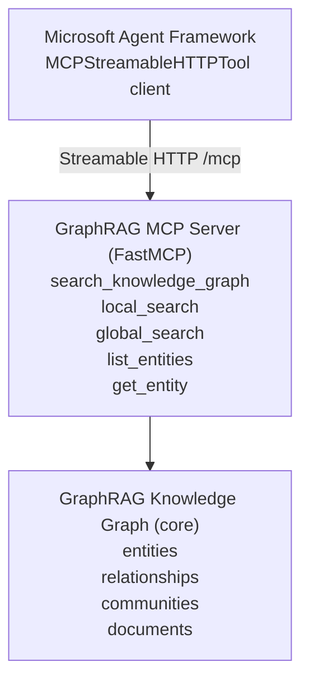

# GraphRAG MCP Server

Exposes GraphRAG functionality as MCP (Model Context Protocol) tools for agent and workflow integration.

The package exposes a validated `MCPConfig` model plus the `create_mcp_server` factory and `app` ASGI object. Use the factory when you need to embed the server inside another host process; import `app` directly for ASGI runners like Uvicorn or Gunicorn.

## Architecture



## Quick Start

> FastMCP 4.x implements the Model Context Protocol [Stateless 2026-07-28](https://modelcontextprotocol.io/specification/2026-07-28) contract. Agent Framework's MCPStreamableHTTPTool interoperates with the Streamable HTTP transport, but its 1.17 release still stops at the legacy initialize handshake instead of issuing `server/discover`, so modern-only metadata is unused until that client adds discovery support.

### Start MCP Server

```bash
# Using Python module
uv run python -m maf_graphrag.mcp_server.server

# Or using convenience script
uv run python run_mcp_server.py
```

Server will start at: `http://localhost:8011`

At startup, the server emits structured logs to console and to `logs/run_mcp_server_YYYYMMDD.log`.

### Test Tools

```bash
# Option A: Test in notebook (recommended, no server needed)
jupyter notebook notebooks/02_test_mcp_server.ipynb

# Option B: Use MCP Inspector (interactive testing via server)
uv run python run_mcp_server.py  # Start server first
npx @modelcontextprotocol/inspector
# In the UI: Transport = Streamable HTTP, URL = http://localhost:8011/mcp
```

## MCP Tools

### search_knowledge_graph

Main entry point for queries. Routes to local or global search.

```python
{
    "query": "Who leads Project Alpha?",
    "search_type": "local",  # "local" or "global"
    "community_level": 2,
    "response_type": "Multiple Paragraphs"
}
```

### local_search

Entity-focused search for specific questions.

**Best for:**

- "Who leads Project Alpha?"
- "What technologies are used in X?"
- "Who resolved the incident?"

```python
# Input
{
    "query": "Who leads Project Alpha?",
    "community_level": 2,
    "response_type": "Multiple Paragraphs"
}

# Response
{
    "answer": "Dr. Emily Harrison leads Project Alpha...",
    "context": {
        "entities_used": 19,
        "relationships_used": 47,
        "reports_used": 2,
        "documents": ["project_alpha.md", "team_members.md"]
    },
    "sources": [
        {
            "text_unit_id": "0",
            "document": "project_alpha.md",
            "text_preview": "# Project Alpha - Next-Generation AI Assistant..."
        }
    ],
    "search_type": "local"
}
```

> **Source traceability**: Local search provides full document-level traceability by resolving text unit IDs through the chain: `text_unit → document_id → document title`.

### global_search

Thematic search across the organization via map-reduce over community reports.

**Best for:**

- "What are the main projects?"
- "Summarize the organizational structure"
- "What Azure services are used?"

```python
# Input
{
    "query": "What are the main projects?",
    "community_level": 2,
    "response_type": "Multiple Paragraphs"
}

# Response
{
    "answer": "The main projects at TechVenture are...",
    "context": {
        "communities_analyzed": 32
    },
    "search_type": "global"
}
```

> **No source traceability**: Global search synthesizes answers from community reports (pre-aggregated summaries), not individual text chunks. Document-level provenance is not available by design in GraphRAG's global search.

### list_entities

List entities from the knowledge graph.

```python
{
    "entity_type": "project",  # Optional: filter by type
    "limit": 10
}
```

### get_entity

Get details about a specific entity.

```python
{
    "entity_name": "Dr. Emily Harrison"
}
```

## Testing with MCP Inspector

The [MCP Inspector](https://modelcontextprotocol.io/docs/tools/inspector) is an interactive browser tool for testing MCP servers.

### Setup

```bash
# Terminal 1: Start MCP Server
uv run python run_mcp_server.py

# Terminal 2: Launch Inspector
npx @modelcontextprotocol/inspector
```

### Usage

1. Open the Inspector at `http://localhost:6274`
2. Set **Transport** to `Streamable HTTP` and **URL** to `http://localhost:8011/mcp`
3. Click **Connect**
4. Navigate to the **Tools** tab to see all 5 tools with schemas
5. Select a tool, fill parameters, and click **Run**

### Development Workflow

1. Make changes to tools in `mcp_server/tools/`
2. Restart the MCP server
3. Reconnect Inspector and test affected tools
4. Check the **Notifications** pane for server logs

## Integration Notes

- Agent and workflow runtimes connect to this server through the Streamable HTTP endpoint at `/mcp`.
- Local interactive inspection can use MCP Inspector against the same server.
- `local_search` preserves source traceability, while `global_search` returns synthesized community-level answers.

## Configuration

Environment variables:

| Variable           | Description                     | Default                 |
| ------------------ | ------------------------------- | ----------------------- |
| `MCP_HOST`         | Server host                     | `127.0.0.1`             |
| `MCP_PORT`         | Server port                     | `8011`                  |
| `GRAPHRAG_ROOT`    | GraphRAG root directory         | `.`                     |
| `MCP_CORS_ORIGINS` | Comma-separated allowed origins | `http://127.0.0.1:8011` |

Logging rotation knobs (optional):

| Variable               | Description                               | Default    |
| ---------------------- | ----------------------------------------- | ---------- |
| `APP_LOG_MAX_BYTES`    | Maximum size per log file before rotation | `10485760` |
| `APP_LOG_BACKUP_COUNT` | Number of rotated backup files to keep    | `5`        |

## Module Structure

```
mcp_server/
├── __init__.py           # Package exports
├── config.py             # Configuration management (host, port, CORS)
├── server.py             # FastMCP server implementation
└── tools/
    ├── __init__.py       # Tool exports
    ├── _data_cache.py    # Lazy singleton cache for GraphRAG data
    ├── types.py          # TypedDicts, validation helpers, error-handling decorator
    ├── local_search.py   # Entity-focused search (with source traceability)
    ├── global_search.py  # Thematic search (community reports only)
    ├── entity_query.py   # Direct entity lookup
    └── source_resolver.py # Resolves text unit IDs → document titles
```

## Development

### Running Tests

```bash
uv run pytest tests/mcp_server/test_config.py tests/mcp_server/test_server.py
```

### Adding New Tools

1. Create tool function in `mcp_server/tools/`
2. Decorate with `@mcp.tool()` in `server.py`
3. Update documentation

### Deployment

```bash
# Production with Gunicorn
uv run gunicorn maf_graphrag.mcp_server.server:app -w 4 -k uvicorn.workers.UvicornWorker

# Docker
docker build -t graphrag-mcp .
docker run -p 8011:8011 graphrag-mcp
```

## References

- [Model Context Protocol](https://modelcontextprotocol.io/)
- [FastMCP Documentation](https://gofastmcp.com/)
- [MCP Inspector](https://modelcontextprotocol.io/docs/tools/inspector)
- [Microsoft GraphRAG](https://github.com/microsoft/graphrag)
